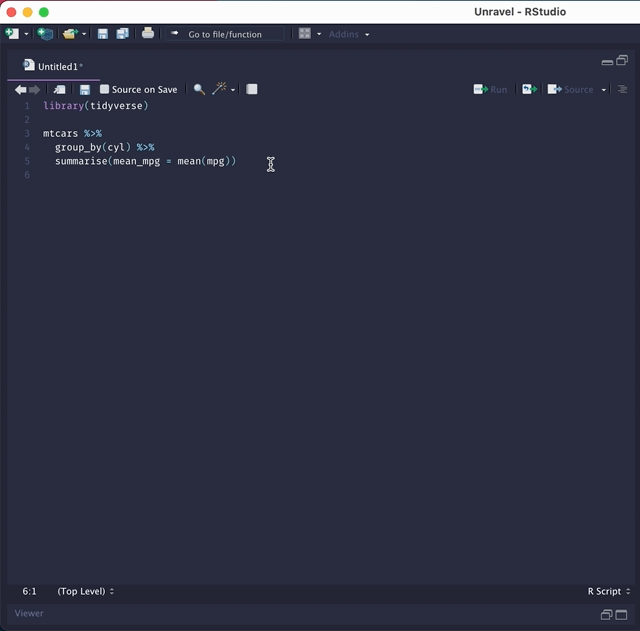
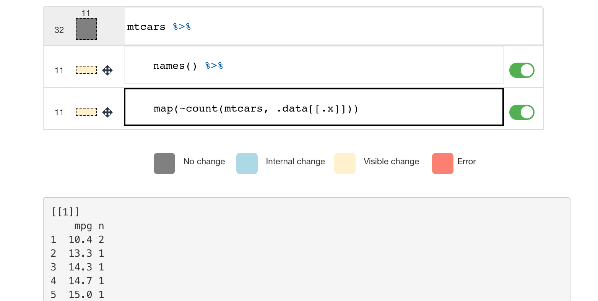
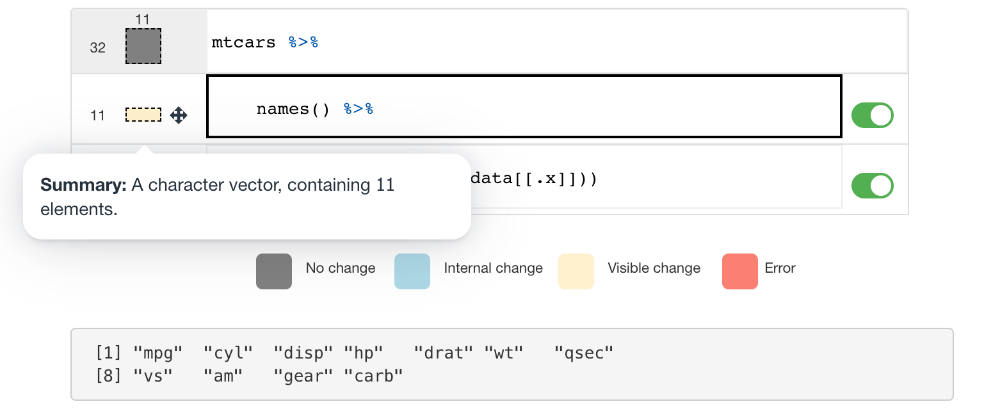

# Unravel: A fluent code explorer for R. 

> Unravel, inspect, and explore fluent code in R.

You can install it with:

```r
# install.packages('devtools')
devtools::install_github('andreweatherman/unravel_native')
```

# Disclaimer:

This is a forked extension of the `Unravel` package that can be found [here.](https://github.com/nischalshrestha/Unravel) The team behind it deserves all the credit. I just added support for the **native pipe** to use in SOC 223 at Duke. What follows is an abridged version of their README. **Again, all credit to them!**

# Usage

With Unravel, you can unravel `dplyr` or `tidyr` code which opens up a Shiny app in RStudio. You can then click on the lines to **inspect the intermediate outputs** (typically dataframes) of the tidyverse code. Both the code and output will be highlighted according to what type of **changes occurred** (no change, visible change, internal change, error).

Unravel also produces **automated function summaries** accessed through the dataframe box. Each function summary (if supported --- see [below](#what-verbs-have-summaries)) describe how the function transformed the previous dataframe in terms of dimensions (shape), whether or not changes were visible or internal (for e.g. grouping).

You can also **perform structural edits** to the code via toggles (comment/uncomment), and reordering lines with drag and drop interactions.

### RStudio IDE

The easiest way to use Unravel is to highlight the tidyverse code you want to unravel, then go to Addins -\> Unravel code.

<p align="center">
  
</p>

This will open up the app on the Viewer pane in RStudio by default. If you want to respect your currently chosen browser window, you can pass `viewer = FALSE` using the programmatic way shown below.

This style of coding always involves starting with a source of data. So, the first expression or line is "locked" such that you can't enable/disable or reorder it and other operations can't be reordered before the first line (as shown at the end of the GIF above).

You can also invoke it programmatically using the `unravel` function by wrapping or piping your code to the function:

```r
# wrapped
Unravel::unravel(
  mtcars %>%
    group_by(cyl) %>% 
    summarise(mean_mpg = mean(mpg))
)
# piped
mtcars %>%
  group_by(cyl) %>% 
  summarise(mean_mpg = mean(mpg)) %>%
  Unravel::unravel()
```

### Other data types

It's also possible to unravel code where steps may produce non-dataframe outputs such as lists or vectors. For example, if we unravel the following code:

```r
mtcars %>%
  names() %>%
  map(~ count(mtcars, .data[[.x]]))
```

The UI now visualizes list/vectors as a slimmer, wider rectangle with only its length reported on the left:



The summaries for lists currently only report the number of elements, but in the future will include more details especially as we add support for `{purrr}` functions.




### What verbs have summaries?

Currently, any `dplyr`/`tidyr` piped code working on single tables will work execution-wise, but only a handful of the functions in each package has explicit support for summaries / has been tested. The summaries are generated by an [extension](https://github.com/nischalshrestha/tidylog) package of the amazing original [tidylog](https://github.com/elbersb/tidylog) package.

In the extension, I have added some enhancements (like data shape summary for every verb and rephrasing summaries) and is specially designed to work with `Unravel` so that I can access the messages in a convenient cache. All verbs supported by `tidylog` besides `join`s will work and some more I added like `arrange`, `rowwise`.

## Performance limitations

Unravel currently starts to lag when handling dataframes that are larger than 100K rows. In the future, I will find ways to optimize the app so it can startup and respond faster for larger datasets. However, at this time try using Unravel for smaller datasets or work on subsets since the tool is more geared towards learning the tidyverse rather than a super scalable tool that is used in 'production' systems.

# Related tools

There are several other similar tools that provide inspection and/or summary of tidyverse code operations and intermediates, which you may find useful as well:

-   [tidylog](https://github.com/elbersb/tidylog): a drop-in solution that logs summaries of steps through `message()` on console output
-   [ViewPipeSteps](https://github.com/daranzolin/ViewPipeSteps): an RStudio Addin that opens up tabs of intermediate outputs
-   [breakerofchains](https://github.com/MilesMcBain/breakerofchains): an RStudio/VSCode Addin that allows inspection of steps through cursor placement in editor
-   [datamations](https://github.com/microsoft/datamations): a framework to generate and visualize pipeline steps through explanations/animations
-   [Tidy Data Tutor](https://tidydatatutor.com): visualizations of tidyverse code focusing on visualizing how each step transforms dataframes
